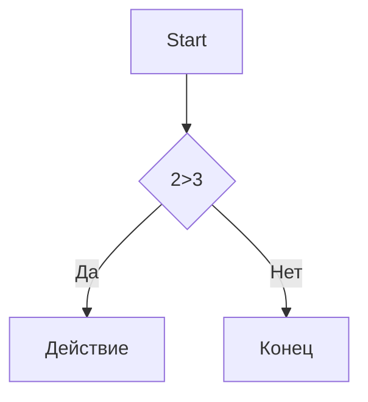

# Заголовок 1
## Заголовок 2
### Заголовок 3
#### Заголовок 4
##### Заголовок 5
###### Заголовок 6

Выделение текста
----------------

*Курсив*  / _Курсив_

**Жирный** / __Жирный__

***Жирный и курсив*** / ___Жирный и курсив___

~~зачеркнутый~~
~~fdgdfdgf~
`моноширинный код`

Списки
------

- Пункт 1
- Пункт 2
  - Вложенный
  - ещё
* Пункт 3
+ Пункт 4

1. Первый
2. Второй
3. Третий
   1. Вложенный
   2. Ещё
      

- [x] 1
- [ ] 2
- [ ] 3

Ссылки
------

[текст ссылки](https://example.com)

[С подсказкой](https://example.com "При наведении")

<https://auto-link.com>

[Ссылочный стиль][1]

[1]: https://example.com


Картинки
--------


[](https://ru.pinterest.com/ideas/обои-для-рабочего-стола-компьютера/929790009455/)


Цитата
------

>Цитата
>
>Много строк
>
> > Вложенная

Код
---

```markdown
print("Hello") Python
```

```python
c = a+b
print(f"{c} = {a} + {b}")
```

Таблицы
-------
 ---: = ориентация справа
 
 :---: ориентация по центру
 
 :--- = ориентация слева
 
| Name | Age | City      |
|-----:|:---:|:----------|
|SS    |34   |   MOd     |
|SS    |34   |   MOd     |
|SS    |34   |   MOd     |
|SS    |34   |   MOd     |
|SS    |34   |   MOd     |
|SS    |34   |   MOd     |

Линии
-----

---
***
___


Экранирование
-------------

\# fdf 

\[ dsdssd \]

Диаграмма
---------



Заголовки
---------

- [Заголовки](#1-заголовки)
- [Списки](#3-списки)
